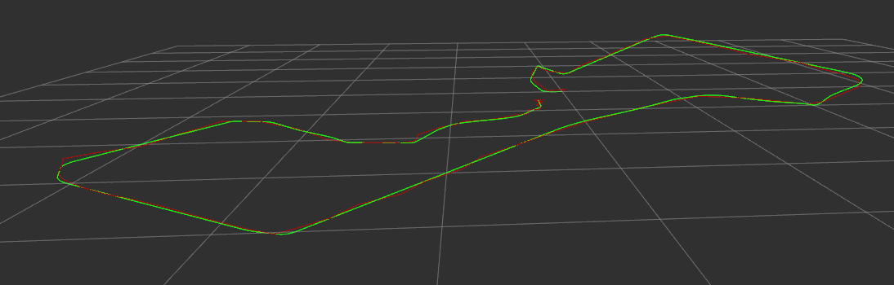

# Kalman Filter Applied

The Kalman Filter Applied package allow you to simulate a trajectory and estimate the odometry based on recorded measurements. The estimation is generated by using the EKF algorithm with constant velocity. The measurements that are taken into account are the following:

* GPS
* Radar



## Installation

**Prerequisites**: you need to have ROS installed.

```bash
mkdir -p catkin_ws/src && cd catkin_ws/src
git clone https://github.com/AleRiccardi/kalman_filter_applied.git
# git clone git@github.com:AleRiccardi/kalman_filter_applied.git

cd ..
catkin init
catkin build
source devel/setup.bash
# source devel/setup.zsh
```

## Usage

To launch the simulator:
```bash
roslaunch kfa simulator.launch
```

To estimate the odometry:
```bash
roslaunch kfa kfa.launch
```

## The Kalman Filter

Kalman filtering is an algorithm that provides estimates of some unknown variables given the measurements observed over time. The unknown variables, in our case, are the 3D coordinates of our object in the simulated environment.

The algorithm works in a two-step process: **propagation** and **correction**. In the propagation step, the current state is propagated along with their uncertainties. Once the outcome of the next measurement (necessarily corrupted with some amount of error, including random noise) is observed, the estimated state is then corrected.

### **State vector**

The state vector at time t is defined as:

<!-- 
$$
\begin{aligned}
\mathbf{x}_t &= 
\begin{bmatrix}
x \\ y \\ z \\ \dot{x} \\ \dot{y} \\ \dot{z}  
\end{bmatrix}
\end{aligned}
$$
 -->


where x, y, z are the 3D coordinates and x, y, z (dot) are the velocities.

### **Propagation step**

The most common dynamic model is a constant velocity (CV) model, which assumes that the velocity is constant during a sampling interval. The linear propagation equation are defined as:

<!-- 
$$
\begin{aligned}
\hat{\mathbf{x}}_{t} &={\mathbf{F}\mathbf{x}_{t-1} + \mathbf{B}\mathbf{u}_{t-1}} \\
 \hat{\mathbf{P}}_{t} &= {{\mathbf{F}}_{t}}{\mathbf{P}}_{t-1}{{\mathbf{F}}_{t}^{\top }}+{\mathbf{Q}}_{t}
\end{aligned}
$$
 -->


The State-transition matrix is defined as:

<!-- 
$$
\begin{aligned}
\mathbf{F} &= 
\begin{bmatrix}
1 & 0 & 0 & \mathrm{dt} & 0 & 0 \\
0 & 1 & 0 & 0 & \mathrm{dt} & 0 \\
0 & 0 & 1 & 0 & 0 & \mathrm{dt} \\
0 & 0 & 0 & 1 & 0 & 0 \\
0 & 0 & 0 & 0 & 1 & 0 \\
0 & 0 & 0 & 0 & 0 & 1 \\
\end{bmatrix}
\end{aligned}
$$
-->


where is the time interval between two propagation steps.

The Control-input matrix is defined as:
<!-- 
$$
\begin{aligned}
\mathbf{B} &= 
\begin{bmatrix}
\frac{1}{2}\mathrm{dt}^2 & 0 & 0 \\
0 & \frac{1}{2}\mathrm{dt}^2 & 0 \\
0 & 0 & \frac{1}{2}\mathrm{dt}^2 \\
\mathrm{dt} & 0 & 0 \\
0 & \mathrm{dt} & 0 \\
0 & 0 & \mathrm{dt} \\
\end{bmatrix}
\end{aligned}
$$ 
-->


### **Correction step**

In the Correction step, the current prediction is combined with current observation information to refine the state estimate. The non-linear correction equation are defined as:
<!-- 
$$
\begin{aligned}
\tilde{\mathbf{y}}_k &=\mathbf{z}_k - h(\hat{\mathbf{x}}_{t})
\\
{\mathbf{S}}_{{t}} &={{{\mathbf{H}}_{{t}}}}{\hat{\mathbf{P}}}_{{t}}{{{\mathbf{H}}_{{t}}^{\top }}}+{\mathbf{R}}_{{t}}
\\
{\mathbf{K}}_{{t}} &={\hat{\mathbf{P}}}_{{t}}{{{\mathbf{H}}_{{t}}^{\top }}}{\mathbf{S}}_{{t}}^{{-1}}
\\\\
{\hat  {{\mathbf{x}}}}_{{t}} &={\hat  {{\mathbf{x}}}}_{{t}}+{\mathbf{K}}_{{t}}{\tilde  {{\mathbf{y}}}}_{{t}}
\\
{\mathbf{P}}_{{t}} &=({\mathbf{I}}-{\mathbf{K}}_{{t}}{{{\mathbf{H}}_{{t}}}})\hat{\mathbf{P}}_{{t}}
\end{aligned}
$$ 
-->


#### GPS measurement

The GPS provides measurements of the position of the object in 3D coordinates:
<!-- 
$$
{\begin{aligned}
h(\hat{\mathbf{x}}_t) &=
\begin{bmatrix}
x \\ y \\ z
\end{bmatrix}
\end{aligned}}
$$ 
-->


The observation Jacobian matrix H is the identity matrix:

<!-- 
$$
\begin{aligned}
\mathbf{H}_t&=
{\frac {\partial h(\hat{\mathbf{x}}_t)}{\partial \left(x,y,z\right)}}&=
{\begin{bmatrix}
1 & 0 & 0 \\
0 & 1 & 0 \\
0 & 0 & 1 \\

\end{bmatrix}}
\end{aligned}
$$ 
-->


#### Radar measurement

The Radar provides measurements of the object in spherical coordinate system:


<!-- 
$$
{\begin{aligned}
h(\hat{\mathbf{x}}_t) &=
\begin{bmatrix}
\rho\\ \theta\\ \varphi
\end{bmatrix}
&=
\begin{bmatrix}
{\sqrt {x^{2}+y^{2}+z^{2}}}\\
\arccos \left({\frac {z}{\sqrt {x^{2}+y^{2}+z^{2}}}}\right)\\
\arctan \left({\frac {y}{x}}\right)
\end{bmatrix}
\end{aligned}}
$$ -->


The observation Jacobian matrix H is defined as:

<!-- 
$$
\begin{aligned}
\mathbf{H}_t&=
{\frac {\partial h(\hat{\mathbf{x}}_t)}{\partial \left(x,y,z\right)}}&=
\begin{bmatrix}
{\frac {x}{\rho }}&{\frac {y}{\rho }}&{\frac {z}{\rho }}\\
{\frac {xz}{\rho ^{2}{\sqrt {x^{2}+y^{2}}}}}&{\frac {yz}{\rho ^{2}{\sqrt {x^{2}+y^{2}}}}}&-{\frac {\sqrt {x^{2}+y^{2}}}{\rho ^{2}}}\\
{\frac {-y}{x^{2}+y^{2}}}&{\frac {x}{x^{2}+y^{2}}}&0\\
\end{bmatrix}
\end{aligned}
$$  
-->


## Contributing

Pull requests are welcome. For major changes, please open an issue to discuss what you would like to change.

## Clang

To use **clang format** you have to run the following command:

```shell script
./scripts/clang_format.sh
```

To use **clang tidy** first you have to generate the `compile_commands.json` file and then run the script:

```bash
catkin config --cmake-args -DCMAKE_EXPORT_COMPILE_COMMANDS=ON 
catkin build

./scripts/clang_tidy.sh $(catkin locate -b -e kfa)
```

## License

The [MIT](https://choosealicense.com/licenses/mit/) licence is used.
